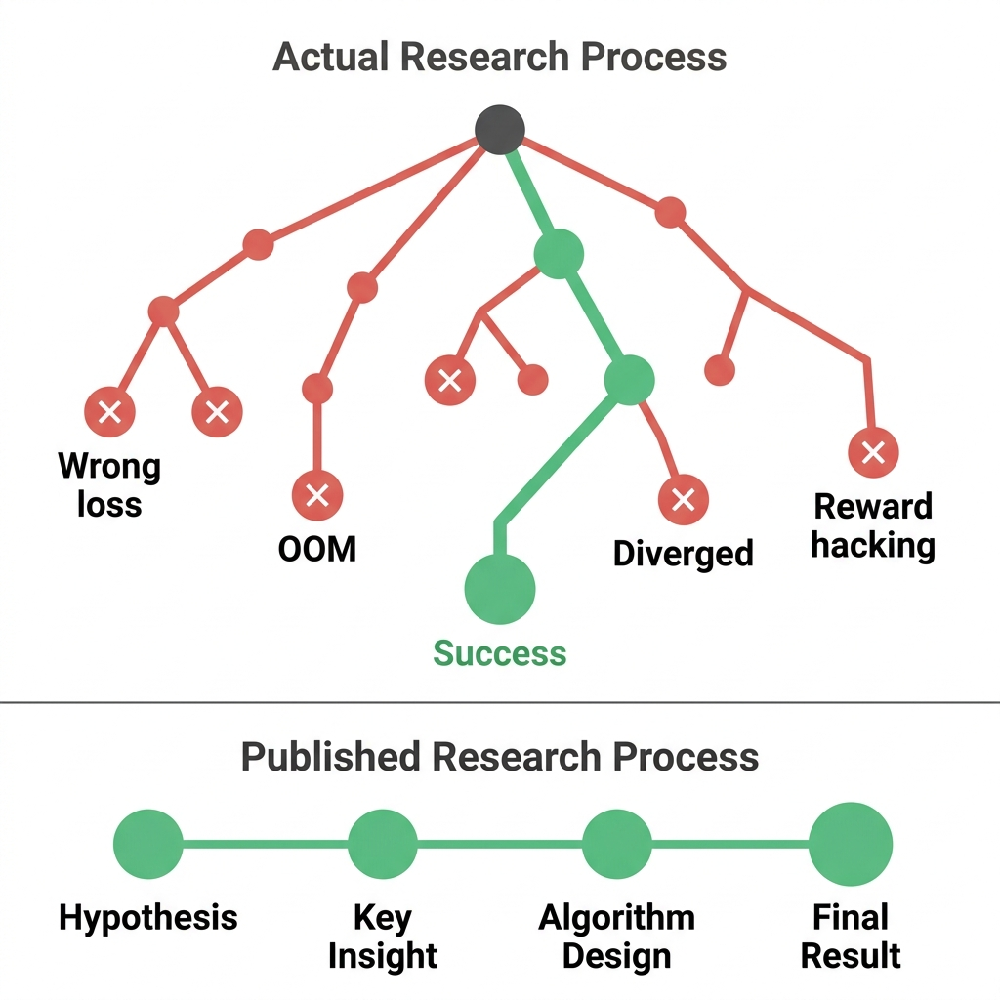
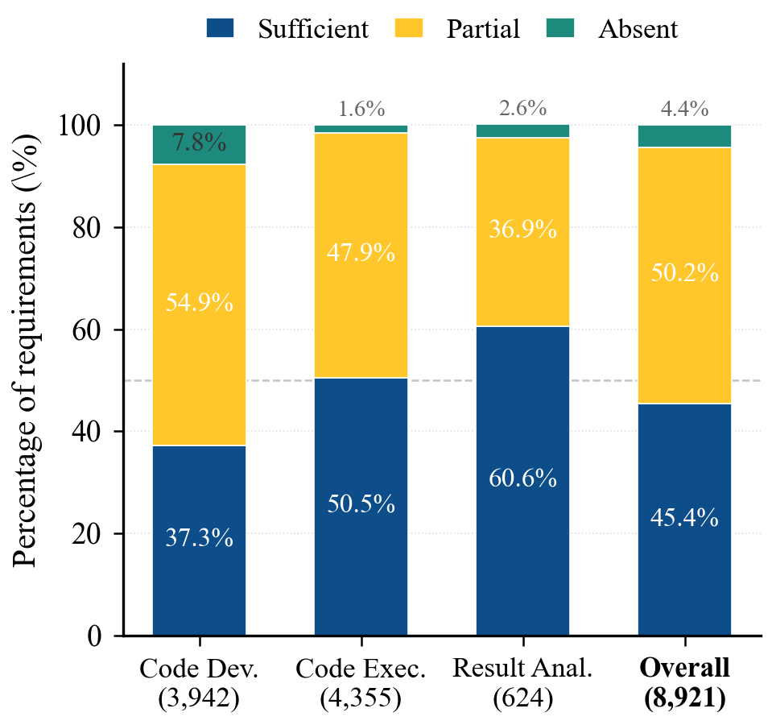
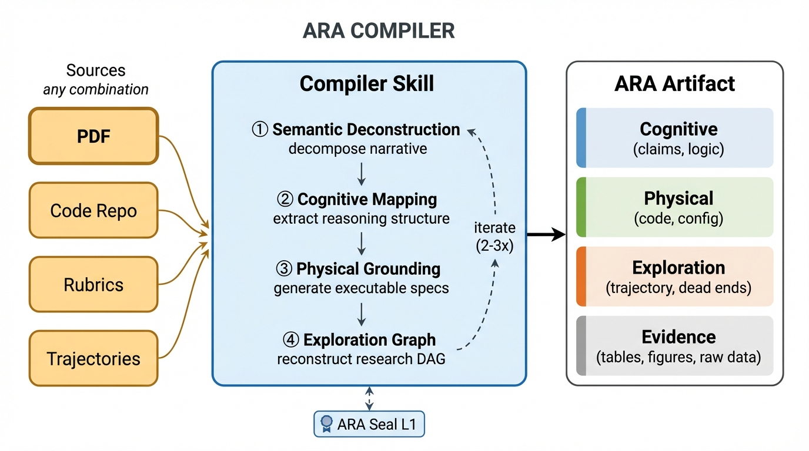

# Agent-Native Research Artifact (ARA)

[](LICENSE)
[](skills/)
[](https://arxiv.org/abs/2604.24658)
[](docs/poster.pdf)
[](https://github.com/ARA-Labs/ARA-Demo)
[](https://aracommons.com/ara)

> A protocol that recasts the primary research object from narrative document to **machine-executable knowledge package** — so AI agents can navigate, reproduce, and extend published research without re-discovering every dead end.

<p align="center">
  
</p>

*Publishing compiles a rich research object into a lossy narrative (left); ARA preserves the original as a high-fidelity, machine-executable knowledge package (right).*

**This repository ships three open-source agent skills — the enablement mechanisms for the ARA protocol:** record your research faithfully *as you do it*, lift any existing paper or repo into the protocol, and audit an artifact's rigor before you ship it. [Jump to how to use it ↓](#how-to-use-it)

---

## The Problem

Research produces a branching knowledge object — months of hypotheses tested and rejected, implementation tricks discovered through trial and error, design alternatives weighed. Publishing compiles this into a linear narrative. That compilation charges **two structural taxes**, and both fall hardest on the AI agents that now routinely read papers to reproduce and extend published work.

<table>
<tr>
<td width="46%" valign="top">

</td>
<td width="54%" valign="top">

</td>
</tr>
<tr>
<td valign="top">

**Storytelling Tax.** The branching exploration — every dead end, divergence, and reward-hack that taught you something — collapses into a single linear path. Failed runs account for **90.2%** of total dollar cost on RE-Bench; with no record of them, every agent rediscovers the same dead ends from scratch.

</td>
<td valign="top">

**Engineering Tax.** The tacit knowledge between paper and code — configs, decisions, tricks — is written nowhere. Only **45.4%** of 8,921 reproduction requirements across 23 ICML 2024 papers are fully specified in their PDFs ([PaperBench](https://openai.com/index/paperbench/)).

</td>
</tr>
</table>

This was tolerable when every reader was human. It is not when the reader is an agent that needs execution-precision, not persuasion.

---

## What is ARA?

ARA organizes research into four interlocking layers:

```
example_artifact/
  PAPER.md                    # Root manifest + layer index (~200 tokens)
  logic/                      # Cognitive layer — What & Why 
    claims.md                 #   Falsifiable assertions with proof refs 
    experiments.md            #   Declarative experiment plans
    solution/
      architecture.md         #   System design + component graph
      algorithm.md            #   Math + pseudocode
      constraints.md          #   Boundary conditions 
    related_work.md           #   Typed dependency graph
  src/                        # Physical layer — How
    configs/                  #   Hyperparameters with rationale
    environment.md            #   Dependencies, hardware, seeds
  trace/                      # Exploration graph — Journey
    exploration_tree.yaml     #   Research DAG with typed nodes + dead ends
  evidence/                   # Raw proof
    tables/                   #   Exact result tables
    figures/                  #   Extracted data points
```

<p align="center">
  
</p>

*Cross-layer forensic bindings thread claims in `/logic` to code in `/src` and evidence in `/evidence`. Dead-end nodes (×) in the exploration graph preserve failure modes.*

### Key design principles

- **Progressive disclosure** — `PAPER.md` (~200 tokens) tells agents whether the artifact is relevant. Deeper files load on demand.
- **Cross-layer binding** — Claims reference experiments, experiments reference evidence, heuristics reference code. Everything is linked.
- **Dead ends preserved** — Failed approaches and rejected alternatives are first-class nodes in the exploration graph, preventing agents from rediscovering known failures.
- **Provenance tracking** — Every entry carries a tag (`user`, `ai-suggested`, `ai-executed`, `user-revised`) distinguishing human-confirmed facts from AI inferences.

---

## How to use it

ARA's four-layer structure is too rich to fill in by hand — and you never have to. **You don't *write* an ARA. Your agent produces one as a byproduct of normal research.** Three open-source skills cover the full lifecycle, and each is useful on its own:

| If you want to… | Skill | Invoke |
|---|---|---|
| **Capture** your research faithfully as you work — the decisions, ablations, dead ends, and configs that would otherwise never get written down | **[research-manager](skills/research-manager/)** | `/research-manager` (or wire it to run automatically) |
| **Compile** an existing paper, repo, or pile of notes into a structured, agent-navigable ARA | **[compiler](skills/compiler/)** | `/compiler <path>` |
| **Verify** an artifact's epistemic rigor before you publish, submit, or review it | **[rigor-reviewer](skills/rigor-reviewer/)** | `/rigor-reviewer <dir>` |

Together they close a loop: capture knowledge while you do the work, lift in the prior work you build on, and check the result against an objective rigor standard.

### 1. Capture your research — `research-manager`

<p align="center">
  
</p>

You're pair-researching with an agent. Hypotheses get tested, ablations get run, ideas get killed — and almost none of it survives into the final writeup. **research-manager fixes that without changing how you work.** It runs an end-of-session epilogue that routes what happened into your `ara/` artifact through a three-stage pipeline (Context Harvester → Event Router → Maturity Tracker).

Trace events (decisions, experiments, dead ends, pivots) are recorded immediately. Knowledge events (claims, heuristics, concepts, constraints) are *staged* and crystallize into formal layers only when a closure signal appears — so you never get premature structure, and your dead ends, configs, and rationale accrue automatically. Every entry is tagged with provenance (`user`, `ai-suggested`, `ai-executed`, `user-revised`), keeping human-confirmed facts distinct from AI inferences.

**Using it:**

1. **Invoke it at the end of a working session** — it reviews the turn and writes new events into `ara/`:
   ```
   /research-manager
   ```
2. **Review what it captured** — trace events land immediately; staged knowledge crystallizes into `logic/` and `src/` once it's settled. Every entry is provenance-tagged, so you always know what came from you versus the agent.
3. **Make it automatic** — append this block to your agent's system-prompt file (`CLAUDE.md`, `AGENTS.md`, `.cursorrules`, or `GEMINI.md`) so it fires every session without you having to remember:
   ```markdown
   ## ARA: end-of-session research capture
   At the END of every coding session, invoke the `/research-manager` skill to
   record decisions, experiments, dead ends, and claims into the `ara/` artifact.
   ```

See [skills/research-manager/SKILL.md](skills/research-manager/SKILL.md) for the full specification.

### 2. Compile existing work — `compiler`

<p align="center">
  
</p>

Already have a PDF, a GitHub repo, experiment logs, or a directory of half-organized notes? The compiler **reverse-engineers it into a complete ARA** through forensic reconstruction — recovering the claims, configs, and (where the evidence allows) the dead ends the narrative dropped. It accepts anything containing research knowledge, in any combination, and runs a 4-stage protocol:

1. **Semantic Deconstruction** — extract raw knowledge atoms
2. **Cognitive Mapping** — map to claims, concepts, experiments
3. **Physical Grounding** — generate configs and code stubs with rationale
4. **Exploration Graph Extraction** — reconstruct the research DAG

In the paper's evaluation it converges in **≤3 rounds on all 30 corpus papers**.

```
/compiler path/to/paper.pdf
/compiler https://github.com/org/repo
/compiler path/to/paper.pdf path/to/code/ --output ./my-artifact/
```

See [skills/compiler/SKILL.md](skills/compiler/SKILL.md) for the full specification.

### 3. Verify rigor — `rigor-reviewer`

Once an artifact exists, **rigor-reviewer audits whether its claims actually hold up.** It is ARA Seal **Level 2**: it assumes Level 1 structural validation has passed (refs resolve, schema valid, links bidirectional), then reasons semantically over the content — scoring six dimensions of epistemic quality such as evidence relevance, falsifiability, and scope calibration. The output is a `level2_report.json` with per-dimension strengths and weaknesses, severity-ranked findings, and an overall recommendation from **Strong Accept to Reject** — so human reviewers can spend their judgment on novelty and significance instead of mechanical checking.

```
/rigor-reviewer path/to/artifact/
```

See [skills/rigor-reviewer/SKILL.md](skills/rigor-reviewer/SKILL.md) for the full specification.

---

## Why it's worth it

These skills aren't speculative tooling. Holding the agent, task, and ground truth fixed, ARA beats a strong **PDF + repo** baseline on all three things agents actually do with research:

| What agents do | Benchmark | PDF + repo | ARA |
|---|---|---|---|
| **Understand** the work | 450 paired questions | 72.4% | **93.7%** &nbsp;`+21.3` |
| &nbsp;&nbsp;↳ recover *failure* knowledge | (subset) | 15.7% | **81.4%** &nbsp;`+65.7` |
| **Reproduce** results | 150 subtasks ([PaperBench](https://openai.com/index/paperbench/)) | 57.4% | **64.4%** |
| **Extend** — time to first useful move | `rust_codecontests` ([RE-Bench](https://metr.org/AI_R_D_Evaluation_Report.pdf)) | 395 min | **9 min** |

The failure-knowledge gap is the headline: a PDF tells an agent what *worked*; an ARA also tells it what *didn't*. On extension tasks that is the difference between an agent committing to the right approach after reading one heuristic at **9 minutes** versus rediscovering it independently at **395 minutes**.

---

## Install

```bash
npx @ara-commons/ara-skills
```

Auto-detects Claude Code, Cursor, Gemini CLI, OpenCode, Codex, and Hermes, then prompts for skills, agents, and install scope (global vs. local).

Full CLI reference: [`packages/ara-skills/`](packages/ara-skills/).

---

## Compatibility

These skills follow the [Agent Skills open standard](https://agentskills.io/specification) and work with:

- [Claude Code](https://claude.ai/code) (Anthropic)
- [Codex CLI](https://github.com/openai/codex) (OpenAI)
- [GitHub Copilot](https://github.com/features/copilot)
- [Cursor](https://cursor.com)
- Any agent supporting the Agent Skills specification

---

## Citation

If you use ARA in your research, please cite:

```bibtex
@misc{liu2026humanwrittenpaperagentnativeresearch,
      title={The Last Human-Written Paper: Agent-Native Research Artifacts}, 
      author={Jiachen Liu and Jiaxin Pei and Jintao Huang and Chenglei Si and Ao Qu and Xiangru Tang and Runyu Lu and Lichang Chen and Xiaoyan Bai and Haizhong Zheng and Carl Chen and Zhiyang Chen and Haojie Ye and Yujuan Fu and Zexue He and Zijian Jin and Zhenyu Zhang and Shangquan Sun and Maestro Harmon and John Dianzhuo Wang and Jianqiao Zeng and Jiachen Sun and Mingyuan Wu and Baoyu Zhou and Chenyu You and Shijian Lu and Yiming Qiu and Fan Lai and Yuan Yuan and Yao Li and Junyuan Hong and Ruihao Zhu and Beidi Chen and Alex Pentland and Ang Chen and Mosharaf Chowdhury and Zechen Zhang},
      year={2026},
      eprint={2604.24658},
      archivePrefix={arXiv},
      primaryClass={cs.LG},
      url={https://arxiv.org/abs/2604.24658}, 
}
```

---

## Contributing

See [CONTRIBUTING.md](CONTRIBUTING.md) for how to add or improve skills.

## License

[MIT](LICENSE)
