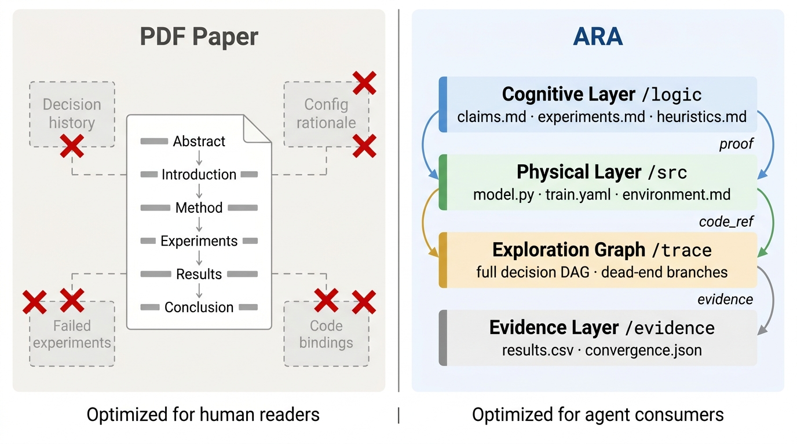
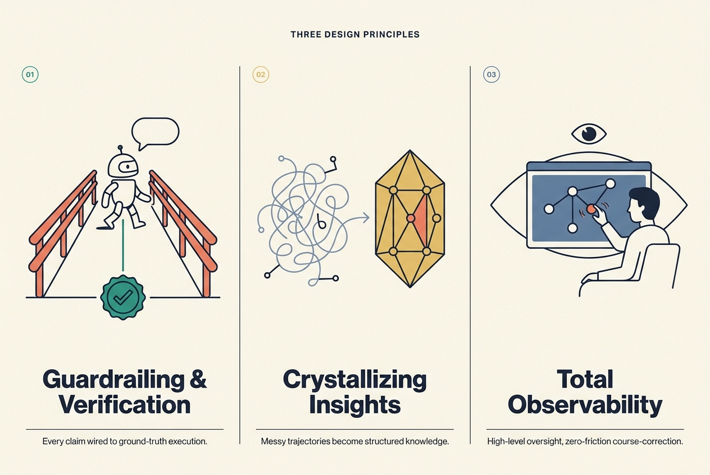
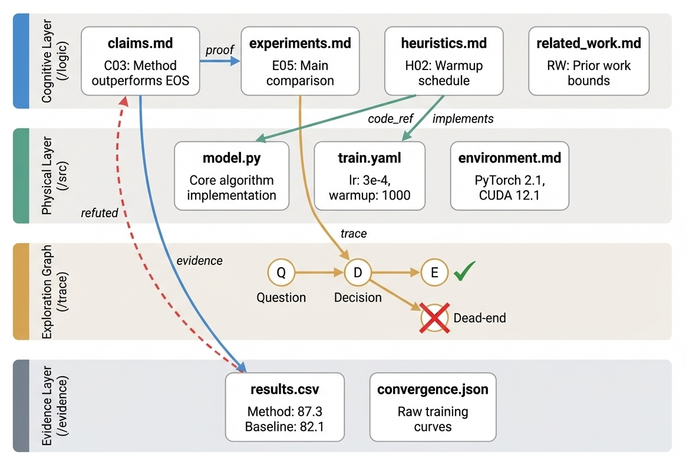

# Agent-Native Research Artifact (ARA)

[](LICENSE)
[](skills/)
[](https://arxiv.org/abs/2604.24658)
[](docs/poster.pdf)
[](https://github.com/ARA-Labs/ARA-Demo)


> **The ecosystem layer for AI scientists.** A protocol and skill bundle that makes autoresearch **verifiable, crystallized, and observable** — so trust scales with speed instead of collapsing under it.

---

## The new bottleneck in science

AI scientists can now generate hypotheses, execute experiments, and produce results at near-infinite speed. But this acceleration has created a new fundamental bottleneck: **How do we verify it? And how do we effectively guardrail the process?**

When an AI generates thousands of exploratory steps, human researchers cannot manually untangle the logs to ensure empirical rigor. We need a fundamental shift in how research is documented and supervised.

<p align="center">
  
</p>

*Publishing compiles a rich research process into a lossy narrative (left). ARA preserves it as a structured, machine-executable knowledge package the AI scientist writes and the human reads (right).*

**ARA is a bundle of agent skills and protocols** built to solve this bottleneck. It provides a rigorous, structured way to document research knowledge, strategically crystallize insights over time, and make autonomous scientific processes entirely observable and verifiable. [Jump to how to use it ↓](#quickstart)

---

## Core Design Principles

Instead of leading with layers, the bundle maps directly to how it solves the bottleneck through three core design principles:

<p align="center">
  
</p>

### 🛡️ Guardrailing & Verification

AI agents require precise constraint boundaries to prevent hallucinated conclusions. The system acts as a strict **epistemic anchor**, automatically applying formal verification principles to ensure every scientific claim is directly wired to ground-truth execution and falsifiable results.

### 🧠 Crystallizing Insights

Research is rarely a straight line; it is a messy graph of pivots and dead ends. The system forces AI scientists to systematically document their trajectory, crystallizing fleeting, unstructured logs into highly structured, reliable research knowledge that builds compounding value over time.

### 👁️ Total Observability

Supervising AI scientists shouldn't require reading endless terminal outputs. The system translates complex agent behaviors and exploration graphs into a clean, minimalist interface. It lets human researchers maintain high-level oversight, seamlessly stepping in to course-correct or guide the AI's behavior with zero friction.

## 🛠️ Quickstart: The Six Core Skills

To operationalize these design principles, ARA provides six specialized agent skills. You can install them via:

```bash
npx @ara-commons/ara-skills
```

Auto-detects Claude Code, Cursor, Gemini CLI, OpenCode, Codex, and Hermes, then prompts for skills, agents, and install scope (global vs. local). Full CLI reference: [`packages/ara-skills/`](packages/ara-skills/).

Then reach for a skill by what you need:

| If you want to… | Skill | Invoke |
|---|---|---|
| **Capture** research faithfully as you work — decisions, ablations, dead ends, configs | **research-manager** | `/research-manager` (or wire it to run automatically) |
| **Compile** an existing paper, repo, or notes into a structured ARA | **compiler** | `/compiler <path>` |
| **Verify** an artifact's epistemic rigor before you trust, publish, or submit it | **rigor-reviewer** | `/rigor-reviewer <dir>` |
| **Observe** the full research trajectory in an interactive process map | **research-visualizer** | `/research-visualizer <ara-dir>` |
| **Submit** an ARA — validate/compile it, visualize it, publish it to your GitHub, and list it on the ARA Hub | **submit-ara** | `/submit-ara <dir>` |
| **Ask** an ARA anything — what to try next, why something worked, what happens if you change X | **research-foresight** | `/research-foresight <ara-dir> "<question>"` |

### Ask your artifact: `research-foresight`

The ARA is not just a record — it is a **world model** your agent can query. `research-foresight`
turns any coding agent into a read-only reasoning engine over one ARA: it retrieves precedent from
the artifact's native files (claims, trace nodes, dead ends, evidence), then answers the question
you actually asked — grounded in citations, with the speculative part labelled. No SDK, no API key;
the agent itself is the LLM.

```text
/research-foresight ./ara "what if I double the warmup steps?"
```

It returns the **answer** plus an honesty envelope:

- `basis` — the native refs it actually read (`trace:N31`, `logic/claims.md#C05`, …)
- `grounded_inference` vs `speculative_leap` — what follows from the artifact vs the named extrapolation beyond it
- `confidence` + `confidence_reason` — how much to trust it, and the real limiting factor
- `falsifiable` — the concrete observation that would overturn the answer

Any question works: *why did this ablation help? is claim C07 still sound? compare the two
optimizer branches; what should I try next?* — the answer takes whatever shape the question calls for. Ruled-out
directions (dead ends, refuted claims) are surfaced and honoured rather than silently repeated.
The engine is read-only by construction (`allowed-tools: Read, Grep, Glob`) — it never writes to
the artifact.

**Make capture automatic.** Append this to your agent's system-prompt file (`CLAUDE.md`, `AGENTS.md`, `.cursorrules`, or `GEMINI.md`) so the record fills itself in every session:

```markdown
## ARA: end-of-session research capture
At the END of every coding session, invoke the `/research-manager` skill to
record decisions, experiments, dead ends, and claims into the `ara/` artifact.
```

See each skill's `SKILL.md` for the full specification:
[research-manager](skills/research-manager/SKILL.md) ·
[compiler](skills/compiler/SKILL.md) ·
[rigor-reviewer](skills/rigor-reviewer/SKILL.md) ·
[research-visualizer](skills/research-visualizer/SKILL.md) ·
[submit-ara](skills/submit-ara/SKILL.md) ·
[research-foresight](skills/research-foresight/SKILL.md)

---

## Under the hood — the artifact anatomy

The four pillars all read and write one structure. An ARA organizes research into four interlocking layers:

```
example_artifact/
  PAPER.md                    # Root manifest + layer index (~200 tokens)
  logic/                      # Cognitive layer — What & Why
    claims.md                 #   Falsifiable assertions with proof refs
    experiments.md            #   Declarative experiment plans
    solution/
      architecture.md         #   System design + component graph
      algorithm.md            #   Math + pseudocode
      constraints.md          #   Boundary conditions
    related_work.md           #   Typed dependency graph
  src/                        # Physical layer — How
    configs/                  #   Hyperparameters with rationale
    environment.md            #   Dependencies, hardware, seeds
  trace/                      # Exploration graph — Journey
    exploration_tree.yaml     #   Research DAG with typed nodes + dead ends
  evidence/                   # Raw proof
    tables/                   #   Exact result tables
    figures/                  #   Extracted data points
```

<p align="center">
  
</p>

*Cross-layer forensic bindings thread claims in `/logic` to code in `/src` and evidence in `/evidence`. Dead-end nodes (×) in the exploration graph preserve failure modes so no agent re-walks them.*

**Key structural principles**

- **Progressive disclosure** — `PAPER.md` (~200 tokens) tells an agent whether the artifact is relevant; deeper files load on demand.
- **Cross-layer binding** — claims reference experiments, experiments reference evidence, heuristics reference code. Everything resolves.
- **Dead ends preserved** — failed approaches and rejected alternatives are first-class nodes in the exploration graph, not noise to drop.
- **Provenance tracking** — every entry is tagged (`user`, `ai-suggested`, `ai-executed`, `user-revised`), distinguishing human-confirmed facts from AI inferences.

---

## Why it works

The supervision gap is not hand-waving — it shows up as measurable cost. Across benchmarks, an ARA beats a strong PDF + repo baseline on the three things agents do with research (understand, reproduce, extend), most dramatically on recovering the *failure* knowledge a narrative drops. For the full argument — the two structural taxes, the benchmark results, and the case for agent-native research — read the writeup:

**→ [The Last Human-Written Paper: Agent-Native Research Artifacts](https://amberljc.github.io/blog/2026-04-24-the-last-human-written-paper.html)**

This paper practices what it proposes — its own ARA lives at [`docs/the-ara-of-ara`](docs/the-ara-of-ara).

---

## Compatibility

These skills follow the [Agent Skills open standard](https://agentskills.io/specification) and work with:

- [Claude Code](https://claude.ai/code) (Anthropic)
- [Codex CLI](https://github.com/openai/codex) (OpenAI)
- [GitHub Copilot](https://github.com/features/copilot)
- [Cursor](https://cursor.com)
- Any agent supporting the Agent Skills specification

---

## Citation

If you use ARA in your research, please cite:

```bibtex
@misc{liu2026humanwrittenpaperagentnativeresearch,
      title={The Last Human-Written Paper: Agent-Native Research Artifacts},
      author={Jiachen Liu and Jiaxin Pei and Jintao Huang and Chenglei Si and Ao Qu and Xiangru Tang and Runyu Lu and Lichang Chen and Xiaoyan Bai and Haizhong Zheng and Carl Chen and Zhiyang Chen and Haojie Ye and Yujuan Fu and Zexue He and Zijian Jin and Zhenyu Zhang and Shangquan Sun and Maestro Harmon and John Dianzhuo Wang and Jianqiao Zeng and Jiachen Sun and Mingyuan Wu and Baoyu Zhou and Chenyu You and Shijian Lu and Yiming Qiu and Fan Lai and Yuan Yuan and Yao Li and Junyuan Hong and Ruihao Zhu and Beidi Chen and Alex Pentland and Ang Chen and Mosharaf Chowdhury and Zechen Zhang},
      year={2026},
      eprint={2604.24658},
      archivePrefix={arXiv},
      primaryClass={cs.LG},
      url={https://arxiv.org/abs/2604.24658},
}
```

---

## Contributing

See [CONTRIBUTING.md](CONTRIBUTING.md) for how to add or improve skills.

## License

[MIT](LICENSE)
